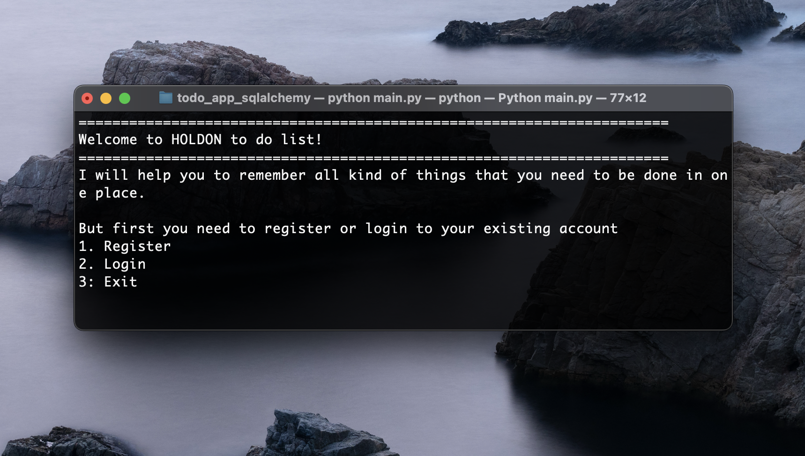
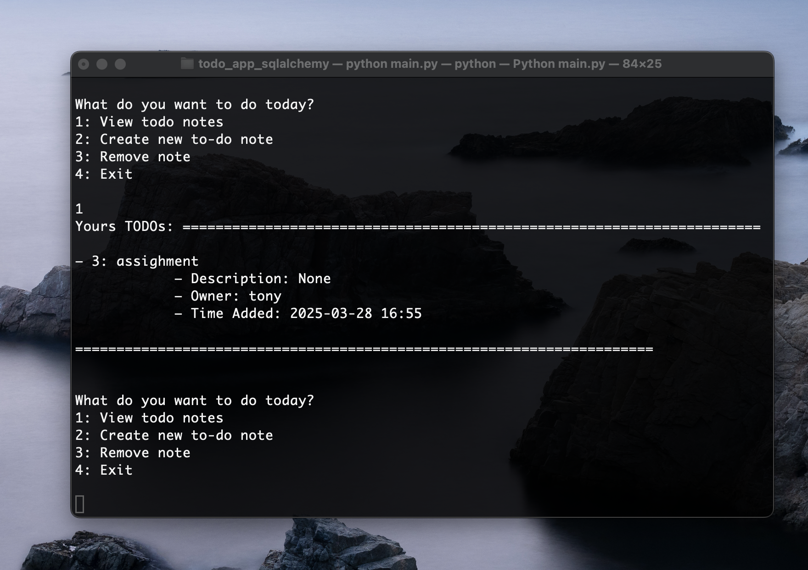

# HOLDON To-Do List

## About
The project is called HOLDON because it was created during exam time, a period when it was difficult to keep track of all the tasks that needed to be completed. A big high five to all the CS students! 🖐🏻




*Perfect for terminal nerds🧑🏻‍💻*

## Overview
HOLDON is a simple to-do list CLI application built with Python and SQLAlchemy. It allows users to register, log in, create, view, and delete notes. Each note has an owner, and users can share notes(will be implemented properly soon).

## Features
- 📎 User registration and authentication
- 📎 Create, view, and delete notes
- 📎 Notes have an owner (primary owner)
- 📎 SQLite database for data persistence

## Installation

1. Clone the repository:
   ```bash
   git clone https://github.com/yourusername/holdon-todo.git
   cd holdon-todo
   ```
2. Create and activate a virtual environment:
   ```bash
   python -m venv venv
   source venv/bin/activate  # On Windows use `venv\Scripts\activate`
   ```
3. Install dependencies:
   ```bash
   pip install -r requirements.txt
   ```
4. Run the application:
   ```bash
   python main.py
   ```

## Usage
1. Run `main.py` and follow the prompts to register or log in.
2. Once logged in, you can:
   - View your to-do notes
   - Create new notes
   - Remove notes

## Database Schema
### Users Table
| Column  | Type    | Description       |
|---------|--------|-------------------|
| userId  | INT    | Primary Key       |
| username | STRING | Unique username  |
| password | STRING | User password    |

### Notes Table
| Column   | Type      | Description              |
|----------|----------|--------------------------|
| noteId   | INT      | Primary Key              |
| name     | STRING   | Note title               |
| description | STRING | Note content            |
| timeAdded | DATETIME | Timestamp of creation   |
| ownerId  | INT      | Foreign Key to Users    |

### User_Notes Table (for shared notes)
| Column  | Type | Description              |
|---------|------|--------------------------|
| userId  | INT  | Foreign Key to Users     |
| noteId  | INT  | Foreign Key to Notes     |

## Troubleshooting
- If you encounter a database error, try deleting `todo.db` and running the app again to recreate tables.
- Ensure your Python environment has all dependencies installed.
